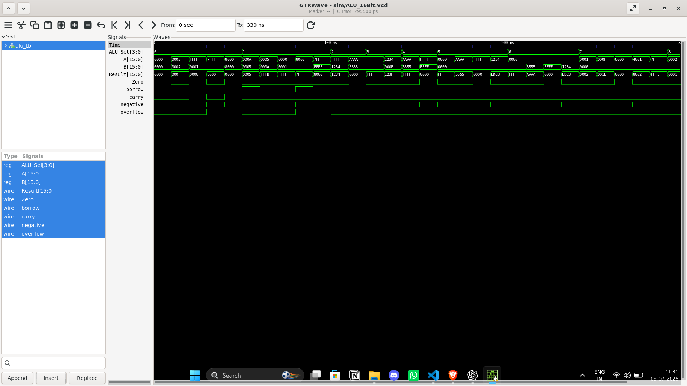

# 16-bit ALU in Verilog

A simple 16-bit Arithmetic Logic Unit (ALU) implemented in Verilog with a directed testbench and GTKWave simulation support.

## Features

The ALU supports the following operations:

| Opcode | Operation |
|--------|-----------|
| `0000` | Addition |
| `0001` | Subtraction |
| `0010` | AND |
| `0011` | OR |
| `0100` | XOR |
| `0101` | NOT A |
| `0110` | NOT B |
| `0111` | Shift Left |
| `1000` | Shift Right |
| `1001` | Compare |
| `1010` | Increment |
| `1011` | Decrement |

---

## Status Flags

| Flag | Description |
|------|-------------|
| `Zero` | Result is zero |
| `Carry` | Carry generated during addition |
| `Borrow` | Borrow indicator for subtraction |
| `Overflow` | Signed overflow |
| `Negative` | Result is negative (`Result[15]`) |

---

## Project Structure

```text
ALU_16bit/
├── README.md
├── src/
│   └── alu.v
├── tb/
│   └── alu_tb.v
└── sim/
    └── ALU_16Bit.vcd
```

---

## Simulation

### Compile

```bash
iverilog -o alu_sim src/alu.v tb/alu_tb.v
```

### Run

```bash
vvp alu_sim
```

### View Waveforms

```bash
gtkwave sim/ALU_16Bit.vcd
```

---

## Waveform



## Example Test Cases

### Addition Overflow

```text
A = 0x7FFF
B = 0x0001
Result = 0x8000
Overflow = 1
```

### Subtraction Overflow

```text
A = 0x8000
B = 0x0001
Result = 0x7FFF
Overflow = 1
```

### Shift Left

```text
A = 0x4001
Result = 0x8002
```

---

## Verification

The testbench includes directed test cases covering:

- Zero results
- Carry generation
- Borrow conditions
- Signed overflow
- Negative results
- Bitwise operations
- Shift operations
- Boundary values (`0x0000`, `0xFFFF`, `0x7FFF`, `0x8000`)

---

## Tools Used

- **Icarus Verilog**
- **GTKWave**
- **VS Code**

---

## Future Improvements

- Arithmetic shift operations
- Variable shift amounts
- Additional comparison flags
- Randomized testbench generation
- SystemVerilog assertions
- Functional coverage

---

## Author

**Pranav Curumaddi**